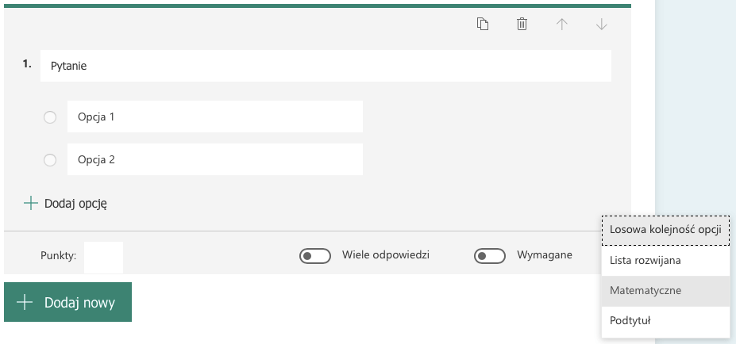

# WTF Form - Ćwiczenia z formularzem

## Prognoza pogody

`Prosty przykład formularza internetowego pozwalającego na prognozowanie pogody w dowolnym miejscu świata`

[Wersja live action](rjankowiak.github.io/wtfform)

## Instrukcja obsługi

1. Uzupełnij dane formularza
	1. Wypełnij pola wyboru
	2. Wypełnij pola inne pola :)
2. Wyślij formularz przyciskiem
3. Poczekaj na prognozę